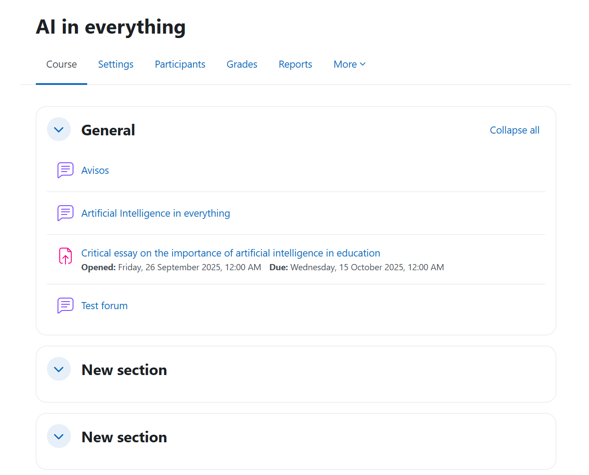
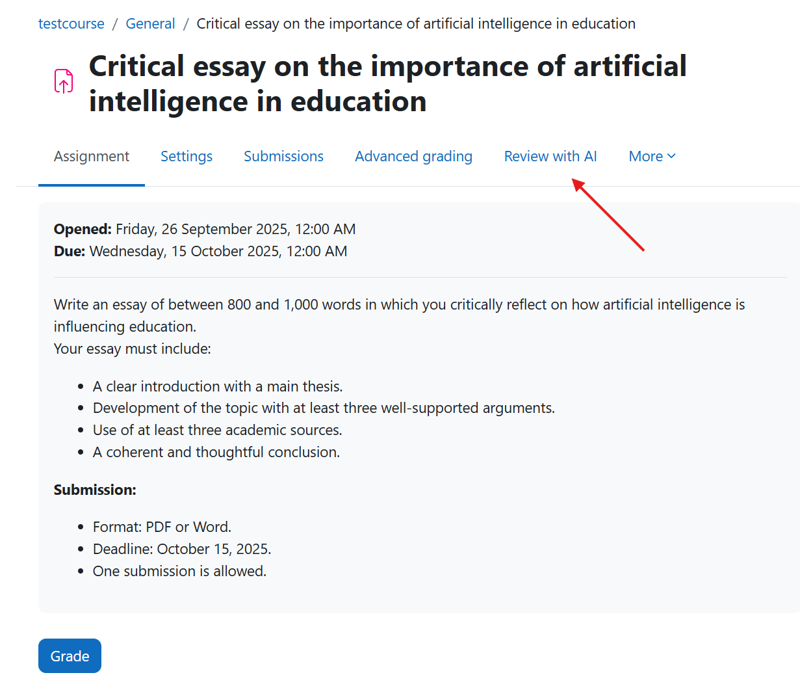
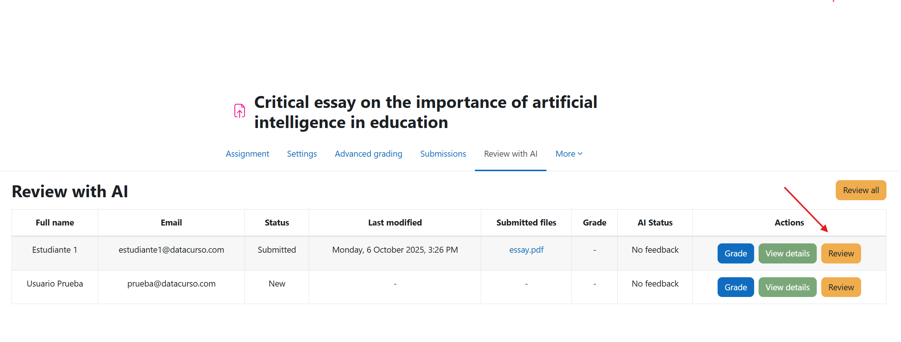
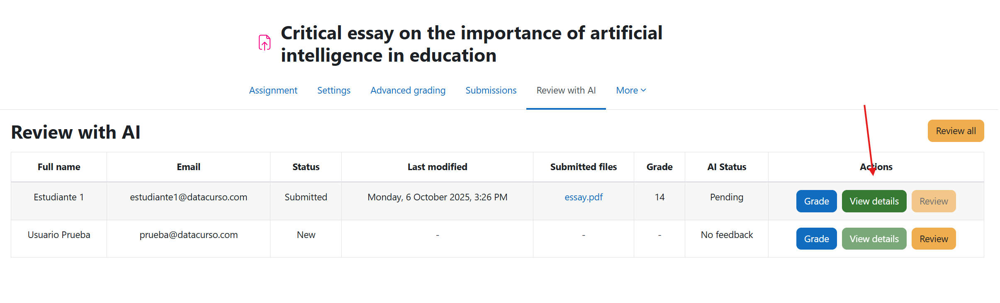
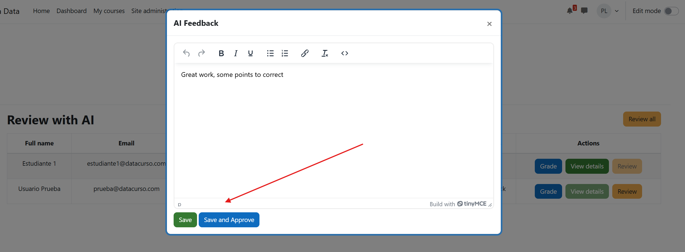
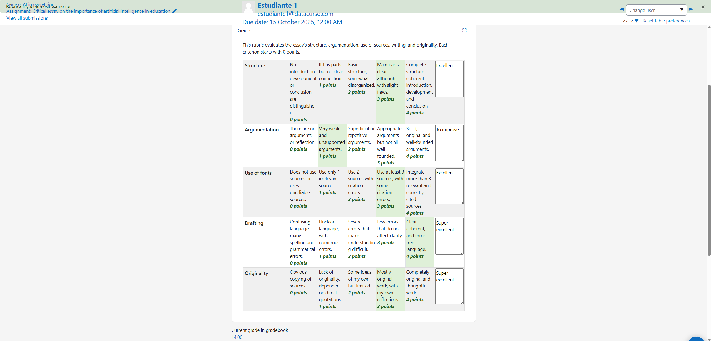

# Assignment AI

This plugin allows administrators and teachers to review assignments submitted by students with the help of Artificial Intelligence.

## Pre-requisites

1. Have at least PHP version 8.1 installed on the server.

2. Have Moodle version 4.1.14 or higher, up to version 4.5.

## Installation via uploaded ZIP file

1. Log in to your Moodle site as an administrator and go to Site `Administration > Plugins > Install Plugins`.
2. Upload the ZIP file with the plugin code. You'll only be prompted to add additional details if the plugin type isn't automatically detected.
3. Check the plugin validation report and complete the installation.

## Manual installation

The plugin can also be installed by placing the contents of this directory in

`{your/moodle/dirroot}/local/assign_ai`

Next, log in to your Moodle site as an administrator and go to Site `Administration > General > Notifications` to complete the installation.

Alternatively, you can run

```bash
php admin/cli/upgrade.php
```

to complete the installation from the command line.

## Review homework with artificial intelligence

1. We enter the task to be reviewed

   

2. We enter the review section with AI

   

3. By clicking the review all button, all students who have submitted their assignment will be reviewed.

   

4. There is also a review button so that you can review a single student.

   

5. Once the rating and feedback is generated, there is an option to view details.

   

6. This opens a modal where we can view the generated feedback, we can edit and save as a draft or save and approve (saving and approving will show the student the grade and feedback).

   

7. By clicking on grade, it will take us to the view to grade a student.

   

8. Here it will automatically show us the answer that the artificial intelligence generated for us with the rubric and grade obtained.

   
