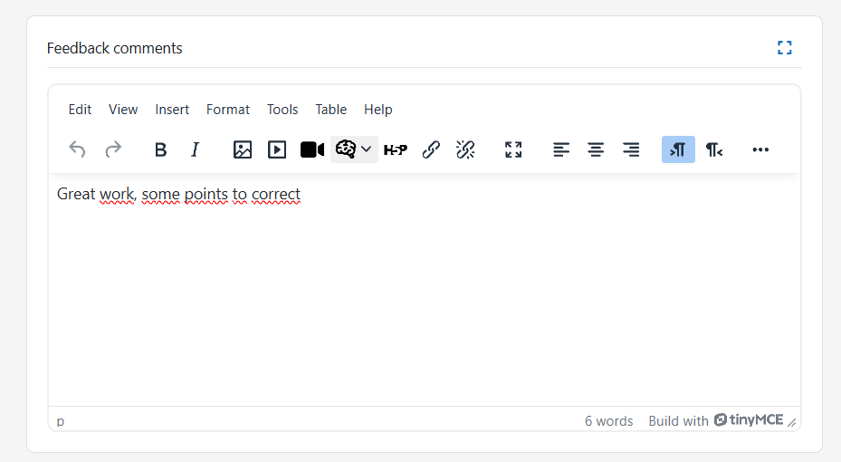

# Assignment AI

The Assignment AI plugin brings intelligent automation to the grading and feedback process within Moodle.
Its main goal is to assist teachers and administrators in reviewing student submissions by analyzing the content of their assignments using Artificial Intelligence (AI).

Through semantic analysis and adaptive interpretation, the plugin evaluates the quality and relevance of each student’s submission and generates personalized suggestions for grades, feedback, and pedagogical comments aligned with predefined criteria or rubrics.

This system does not replace teacher judgment — it acts as an assistant, supporting educators by providing quick, consistent, and constructive insights for every task.

## Pre-requisites

1. Moodle 4.5
2. Install the Moodle AI provider "DataCurso AI Provider". Download it for free from [https://moodle.org/plugins/aiprovider_datacurso/versions](https://moodle.org/plugins/aiprovider_datacurso/versions).
3. In the DataCurso AI Provider settings, configure a valid license key as documented at [https://docs.datacurso.com/index.php?title=Datacurso_AI_Provider#Getting_license_keys](https://docs.datacurso.com/index.php?title=Datacurso_AI_Provider#Getting_license_keys).

**IMPORTANT**: This plugin will not function unless the "DataCurso AI Provider" plugin is installed and licensed.
## Installation via uploaded ZIP file

1. Log in to your Moodle site as an administrator and go to Site `Administration > Plugins > Install Plugins`.
2. Upload the ZIP file with the plugin code. You'll only be prompted to add additional details if the plugin type isn't automatically detected.
3. Check the plugin validation report and complete the installation.

## Manual installation

The plugin can also be installed by placing the contents of this directory in

`{your/moodle/dirroot}/local/assign_ai`

Next, log in to your Moodle site as an administrator and go to Site `Administration > General > Notifications` to complete the installation.

Alternatively, you can run

```bash
php admin/cli/upgrade.php
```

to complete the installation from the command line.

## Review homework with artificial intelligence

Once installed, Assignment AI integrates seamlessly with Moodle’s Assignment module, adding a new layer of functionality that enhances how teachers review student submissions.

Below is the general workflow:

1. Enter the assignment to be reviewed
   
   Teachers start by entering any standard Moodle assignment activity. This can be an essay, report, or file submission created using the usual assignment setup interface.

   

   Assignments can include grading criteria or rubrics — these elements will later be interpreted by the AI to produce accurate analyses and feedback.

2. Access the AI review section
   
   Inside the assignment administration view, a new tab or section called “Review with AI” appears. From here, teachers can access all AI-powered review options.

   

   This interface lists all student submissions, including their current review status (e.g., Pending, Reviewed, or Feedback generated).

3. Review all submissions
   
   By clicking the “Review All” button, the system will automatically send all submitted assignments to the AI engine for evaluation.

   

   The AI analyzes each file or text entry individually, using the defined grading criteria or rubric as a reference framework.
   During this process, the AI evaluates aspects such as:
   - Clarity and coherence of writing.
   - Relevance to the assignment prompt.
   - Conceptual understanding of the topic.
   - Grammar, spelling, and structure.
   - Originality and argumentative quality.

4. Review an individual student
   
   Teachers also have the option to review a single student’s submission by clicking the “Review” button next to that student.

   

   This is useful when the instructor wants to manually supervise or validate the AI’s feedback before approving it.

5. View AI-generated results
   
   Once the AI has analyzed a submission, the system automatically generates a suggested grade and a personalized feedback comment. Teachers can then click “View Details” to see a detailed breakdown of the analysis.

   

6. Edit and manage AI feedback
    
   A modal window opens displaying the full AI-generated feedback.
   Here, the teacher can:
   - Review the AI’s suggested grade and comment.
   - Edit or refine the text to better fit their evaluation.
   - Save the feedback as a draft for later review.
   - Or approve and publish it directly to the student.

   

   When approved, the feedback and grade become visible to the student through the standard Moodle grading interface.

7. Grading interface and rubric integration
    
   By clicking on Grade, the teacher is redirected to Moodle’s standard grading view for that assignment.

   

8. Final AI feedback presentation
    
   The final view shows the full AI-generated textual feedback alongside the corresponding grade. This allows the teacher to see how the AI justified its evaluation based on the assignment’s learning criteria.

   
